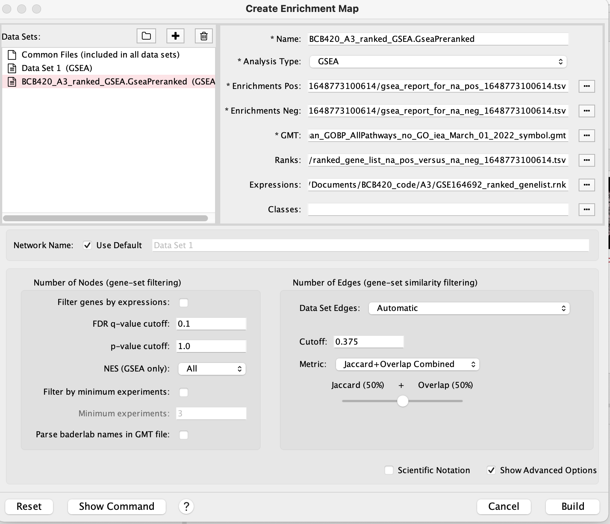
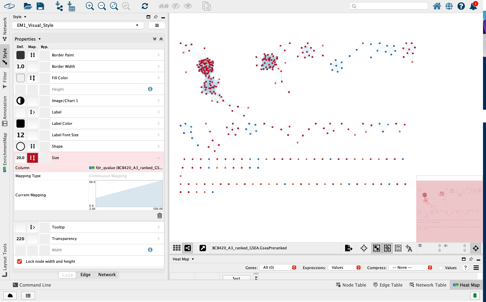
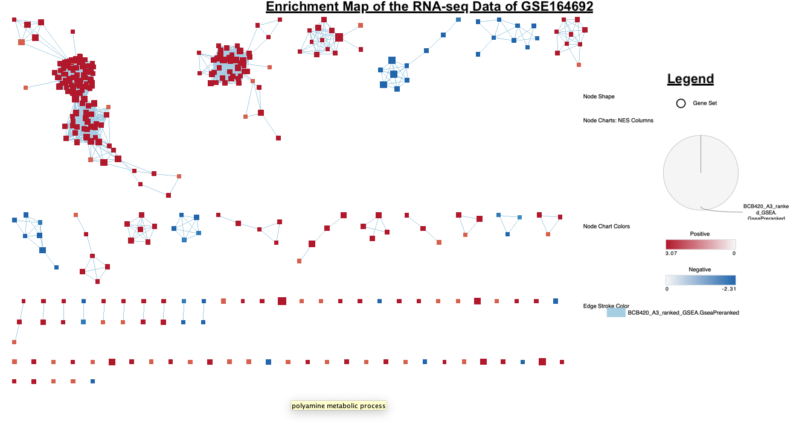
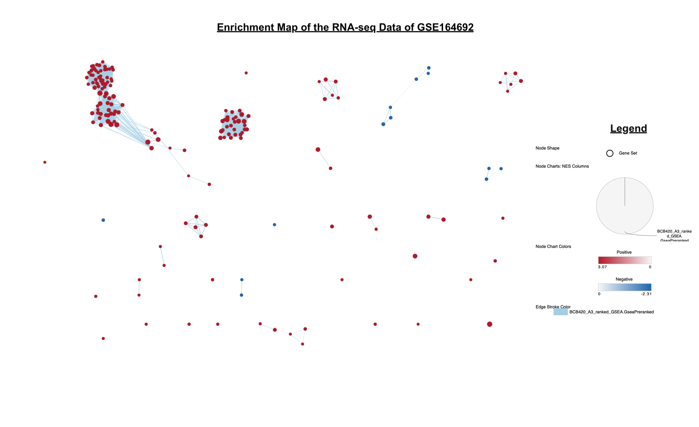
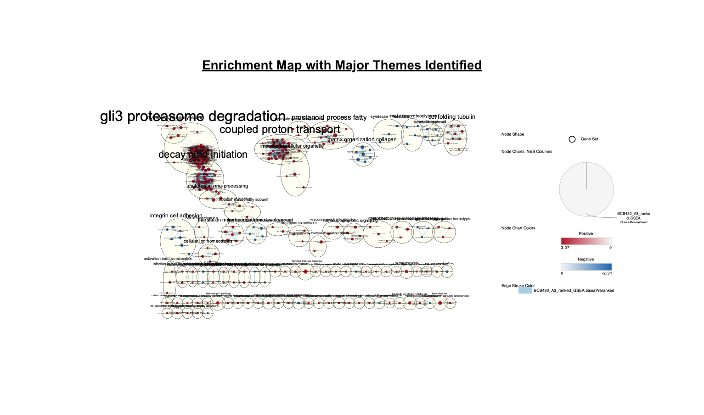
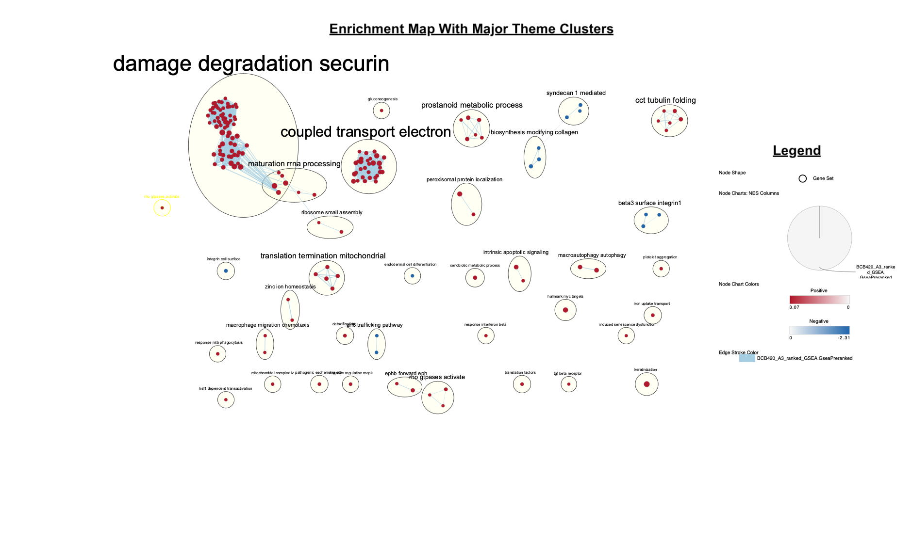
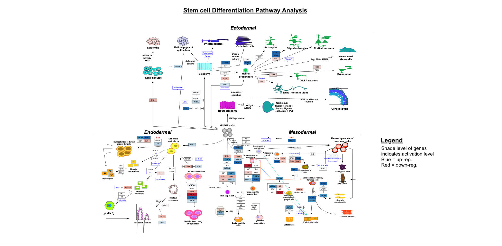
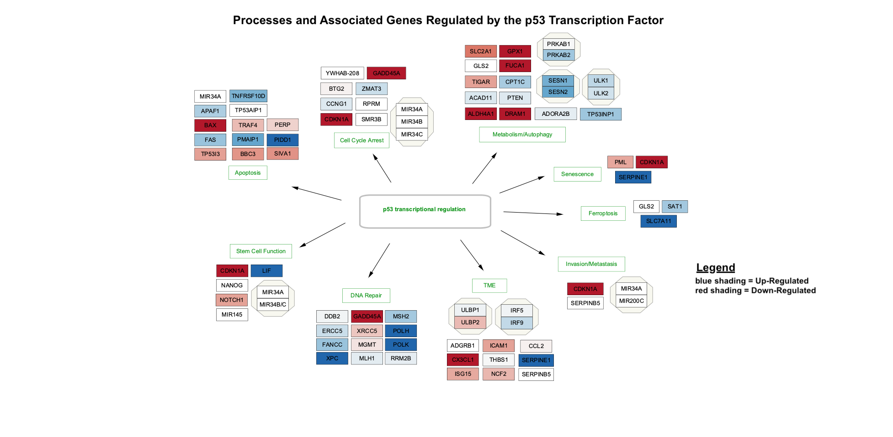

## Table of Contents 
##### Review of Assignment 1 and 2 approaches 
##### Non-thresholded Gene set Enrichment Analysis
###### Automatic Download of Genesets from Bader Lab
###### Gene Set enrichment Analysis
##### Visualize your Gene set Enrichment Analysis in Cytoscape
###### Annotations to the original Network: 
###### Setting up the Map through GUI
###### Collapsing Network to a Theme 
##### Interpretation and Detailed View of Results 
##### Looking at Some of the Pathways - Through WikiPathways 
###### Pathway 1
###### Pathway 2
##### Citations 


Here is the link to my journal entry for Assignmnet 3: https://github.com/bcb420-2022/Erik_Ensminger/wiki/J9:-Assignment-%233---Data-set-Pathway-and-Network-Analysis

Here is the link to all the files I used in assignmnet 3: 
https://github.com/bcb420-2022/Erik_Ensminger/tree/main/A3 

# Review of Assignment 1 and Assignment 2 approaches 
#### Selecting an Expression Data set 

We first had to select the appropriate expression data set. Due to my interest in stem cells, I wanted to focus on studies, which had something to do with this field. I followed the steps to finding a GEO expression data set from lecture in R studio. From there, I filtered for stem cells and chose a study which focuses on amniotic fluid stem cells (haFSCs) of homos apiens with 32 samples. Here is a link to the GEO page: [GSE164692](https://0-www-ncbi-nlm-nih-gov.brum.beds.ac.uk/geo/query/acc.cgi?acc=GSE164692)

#### Brief Overview of Research Paper - and data set 

The study by Casciaro et al. focuses on using fractioning technique to characterise the sub-populations of haFSCs and determine the stemness of these cells. haFSC populations used for RNA-seq data were obtained from 8 pregnant women, known as the donors in the count file. Each of the donors haFSCs population were sorted through Non-Equilibrium Earth Gravity Assisted Field Flow Fractionation principles, whereby cells were run through a fraction. There were 4 different fractions by which  these cells were sorted. Looking at the gene count file of this study, the columns contain the samples and are each represented through a 'donor_#_F#' code. 'Donor_#' represents from which donor the sample is from and 'F#' is which fraction the sample is from. 
Overall, the study found high heterogeinity among patients and fractions, and demonstrated that the applied fractioning technique to sort stem cell sub-populations is an important step to determine pluripotent and differentiation potentials of these cells.

#### Results From Assignment 1 

In Assignment 1, we were able to filter, and normalize our data set. These steps were necessary to eliminate any unwanted noise, that is not important for our analysis in assignmnet 2 and 3. 

#### Results From Assignment 3

In Assignmnet 2, we performed a differential gene expression, looking at specific genes of interest and tried to identify some of the up and downregulated pathways. 
From my interpretation, I noticed that many of the up-regulated pathways were important in stem cell maintenance. These interesting findings, associated to stem cells verfied some of the findings, which the research paper also found. Further analysis in Assignment 3 will give important information on the whole system and its interactions.


# Non-thresholded Gene set Enrichment Analysis

### Automatic Download of Genesets from Bader Lab 

The Bader lab has made a specific geneset that can be used for our upcoming GSEA analysis. This gene set is updated regularly. We  could also download it manually, but I believe downloading straight through R is faster, and gives a better overview of the full process. 


```{r, warning = FALSE, message= FALSE}
#install required R and bioconductor packages
tryCatch(expr = { library("RCurl")},
         error = function(e) {  install.packages("RCurl")},
         finally = library("RCurl"))

tryCatch(expr = { library("BiocManager")},
         error = function(e) {
           install.packages("BiocManager")},
         finally = library("BiocManager"))
tryCatch(expr = { library("ggplot2")},
         error = function(e) { install.packages("ggplot2")},
         finally = library("ggplot2"))
#use easy cyRest library to communicate with cytoscape.
tryCatch(expr = { library("RCy3")},
         error = function(e) { BiocManager::install("RCy3")},
         finally = library("RCy3"))

#path to GSEA jar
gmt_url = "http://download.baderlab.org/EM_Genesets/current_release/Human/symbol/"
# list all the files on the server
filenames = getURL(gmt_url)
tc = textConnection(filenames)
contents = readLines(tc)
close(tc)
# get the gmt that has all the pathways and does not include terms inferred
# from electronic annotations(IEA) start with gmt file that has pathways only
rx = gregexpr("(?<=<a href=\")(.*.GOBP_AllPathways_no_GO_iea.*.)(.gmt)(?=\">)", contents,
              perl = TRUE)
gmt_file = unlist(regmatches(contents, rx))
dest_gmt_file <- file.path(getwd(), gmt_file)
download.file(paste(gmt_url, gmt_file, sep = ""), destfile = dest_gmt_file)
```

### Gene Set enrichment Analysis
There are many different algorithms available to run a gene set enrichtment analysis. One of the most populaire is the GSEA, partly due to its user friendly GUI. Also, in lecture, the professor said to run the GSEA algorithm through the Java GUI, since the R package of GSEA seems to be outdated. 
We will run GSEA using the dataset from the Bader Lab, which we downloaded above. 
From the previous step we have also already downloaded the necessary libraries. 


1. What method did you use? What genesets did you use? Make sure to specify versions and cite your methods. 
    * After opening up the GUI to the GSEA application, I uploaded my rank file (from assignment 2) and gmt file which I obtained from the Bader Lab. 
    * I then ran a GSEAPreranked, on GSEA version 4.2.3. I also selected the following parameters for the analysis
      * Collapse/Reemap to gene symbols: No Collapse 
      * maximum geneset size of 200 
      * minimum gene set size 15. 

2. Summarize your enrichment results.
  * The the gene set filters, where min =15 and max = 200, were able to filter out 13/529 genes. Thereby, in the actual GSEA analysis, there were 5016 genes. 
  * From these genes, there ewre 84 genes that had a p-value of < 1%. In addition there were 211 genes that were significantly enrichen at p-value < 5%. In addiiton 62 genes had a FDR value < 25%. These results show that there are some signficant genes in my data set, that have an important role, and maybe are signficant to the research. 
  * Looking at the enrichment results, some of the major encrichment results include " GTP HYDROLYSIS AND JOINING OF THE 60S RIBOSOMAL SUBUNIT", "	CAP-DEPENDENT TRANSLATION INITIATION", "EUKARYOTIC TRANSLATION INITIATION". Since the paper exclusively examines stem cell fractioning, I believed these enrichment analysis would give processes related to the stem cell characteristics, such as pluripotency, or lack of cell differentitation. However, these results seem to related to the average cell, such as Eukaryotic Translation initiation. Examining these processes, does not give an overall view of the whole system interaction. 
  * I think further analysis is needed to determine further biological themes, processes related to the research paper. 

Please follow the link to see further information on the GSEA analysis output folder: summary html file: https://github.com/bcb420-2022/Erik_Ensminger/tree/main/A3 


3. How do these results compare to the results from the thresholded analysis in Assignment #2. Compare qualitatively. Is this a straight forward comparison? Why or why not?

  * The comparison of the assignmnet 2 analysis and the GSEA analysis is not straightforward. The analysis in assignment 2, used a differnet number of genes (as we thresholded them by a p-value). In the GSEA analysis, after filtering, we had 5016 genes sets. 
However, the results of both the analyses vwere similaire. The top genes that were found the GO analysis, and WikiPathways from Assignmnet 2, were among the top in the GSEA analysis. 

# Visualize your Gene set Enrichment Analysis in Cytoscape


### Setting up the Map through GUI 

#####  Cytoscape version:
* Version: 3.9.1 
* Java: 11.0.13 by Eclipse Adoptium 
* Java Home: /Library/Java/JavaVirtualMachines/temurin-11.jdk/Contents/Home 
* OS: Mac OS X 11.4 - x86_

To visualize the Gene set Enrichment Analysis we will use the Cytoscape application. Cytoscape has a large commuunity and allows
for further plug-ins. Here we will use the EnrichmentMap Cytoscape App, which allows us to take the pathway and creates a network. 
In the EnrichmentMap plug-in, nodes are defined as a pathway or a gene set. Thereby the node is not a gene or a single protein but a grouping. The genesets are connencted by the number of genes they have in common, which will be the edges between the nodes.

The EnrichmentMap allows us to simply select the output folder from the GSEA analysis. 

Here is how I set up the GUI. 
```{r fig1, echo=FALSE, fig.cap="Initial set of the EnrichmentMap", out.width = '70%'}

```

##### Parameters I selected for the set up:

* Number of Edges: 
  * Similarity coefficient method: Jacard + Overlap Combined (default)
    * Cutoff: 0.375

* Number of Nodes:
  * FDR q-value cutoff: 0.1
  * p-value cutoff: 1.0  

* Default style of the enrichment map: 
  * size of node corresponds to the size of the geneset
  * colour of node corresponds to the phenotype and the p-value
  * label of the node corresponds to the geneset description
  * thickness of the edge corresponds to overlap statistic. The more genes two nodes have in common the thicker the edge.

```{r fig2, echo=FALSE, fig.cap="The EnrichmentMap set up ", out.width = '70%'}

```

Most of these parameters are default. I believe this is best, since I first want to see the full network, to see any relationships and then further filter in the next steps. And these parameters are apparently better for larger data sets  as recommended by the our lectures.
```{r fig3, echo=FALSE, fig.cap="The EnrichmentMap set up ", out.width = '100%'}

```

#### Annations to the original Network: 
For the default values, the size of the node is the size of the gene sets corresponding to the node. However, I want to change this parameter so the size of the node, corresponds to the significance of the gene-set. This will give us clear visual representation of the different gene sets. However, when I changed the size paramter of the node from the size of geneset to the FDR value, which should give us a signficance value, I  could not identify any signficant changes. Thereby, I will continue to use the default settings. 
However, after looking at the map, I limited the node cutoff to 0.02. This made the map more viewable. In add
I also seperated some of the clusters, so the clusters do not overap. 
```{r fig4, echo=FALSE, fig.cap="The EnrichmentMap set up ", out.width = '100%'}

```

##### Number of nodes and edges in the EnrichmentMap
We now have 203 nodes and 807 edges. 

Initiatal impressions of Map: When first opening up my file, the first thing I notice is the there are pathways/genesets (on the bottom of the map), that are completely seperate from the rest of the gene sets. In addition, there are 2 really large connected gene-sets (in red at the top of the map), and two smaller clusters to the right of map. 

### Collapsing Network to a Theme 
I followed the detailed steps in the "Pathway enrichment analysis and visualization of omics data using g:Profiler, GSEA, Cytoscapeand EnrichmentMap" Paper, which explained how to identify the major themes in the Map. 

Here are the major themes in the network. They are currently hard to visually see. 

```{r fig5, echo=FALSE, out.width = '100%'}

```

Therefore, I further spaced out the nodes, and removed smaller clusters.
Some of the major themes include: damage degredation securin (74 nodes), coupled transport electron	(30 nodes), ccct tubulin folding (6 nodes). 

```{r fig6, echo=FALSE, out.width = '100%'}

```

# Interpretation and Detailed View of Results 

1. Do the enrichment results support conclusions or mechanism discussed in the original paper? How do these results differ from the results you got from Assignment #2 thresholded methods

  *The main focus of the original paper, was to determine a viable fractioning technique for stem cells present in amniotic fluic. Thereby, I expected the enrichment results to identify important factors in stem cell niches, to maintain stem cell pluripotentcy. Altough there were some clear genesets, associated to stem cell properties, some findings are very random. The high heterogeinity amongst the donors for the original research paper, as also noted by the research team could contribute to not finding clear mechanisms. In assignment 2, the thresholded methods and analysis through GSEA gave me similaire results such as enrichment in eukaryotic translation elongation from the Reactome. The slight differences as mentioned at the start of this report is due to the difference in the number of genes used in the analysis. 
However, I found the analysis on the p53 very interestingly (see pathway section below), since many of the transcription factors are important in stem cells. 

2. Can you find evidence, i.e. publications, to support some of the results that you see. How does this evidence support your result? 

  *Since our results from assignment 2 and assignment 3 are , the research papers from assignment 2 also provide evidence. Due to stem cells being un-differentiated, pluripotent cells, many of the genes sets to be enriched are involved in maintaining the un-differentiated state. The p53 gene, for example is very important in stem cells, and was shown to be up-regulated in our analysis. Thereby, the genes that are regulated by the p53 TF, are affected which can be seen by the Pathway #2 analysis below. 
Other research papers such as from  (Srivastava et al. 2018) and (Stuppia et al. 2012), further provide the stem cell characteristics in amniotic fluid. Interestingly, one of the most prominent themes in the map were the"damage degredation securin". Degredation of securin is necessary to progress in mitosis (Pines et al. 2002). Altough these stem cells were inhibited from differentiation, they stil are actively dividing to increase the number of stem cells and further increase developement of the fetus that is surrounded by the amniotic fluid. This reasoning may support the finding of the huge damage degredation securin" cluster in the EnrichmentMap. 


# Choose a specific pathway or theme to investigate in more detail. Why did you choose this pathway or theme? Show the pathway or theme as a gene network or as a pathway diagram. 

For the last step I chose to look at the Pathway Analysis through WikiPathways. 

### Looking at Some of the Pathways - Through WikiPathways 
I decided to look at two pathways. One for the general pathway of important genes involved in cell differentitation of stem cells and a pathway more specific, that investigates the p53 transcription factor, that I already investigated in assignmnet 2. 

#### Pathway 1: Looking at the General Stem Cell Differentation Pathway through WikiPathway 
The focus of the research paper which generated the RNA-seq data focuses on stem cell fractioning from amniotic fluid. Amniotic fluid surrounds the unborn baby during pregnancy. Thereby, there are many pluripotent stem cells that could be extracted from these cells. I therefore wanted to first find a pathway from WikiPathway that could give an overview of genes involved in many different processes in stem cell differentiation. I found a pathway called "Pluripotent stem cell differentiation pathway". 
To further annotate the pathway I added the rank file to the node column table. Thereby, I can see some of the genes that active in the amniotic fluid. I found it interesting since there a many genes that are active in the stem cell differentiation. This is to be expected as the cell sample are taken from the amniotic fluid of pregnant women, where the fetus is developing. 
I want to further investigate what specific pathways are regulated, so I will look at the p53 transcription factor in a second pathway. 

```{r fig7, echo=FALSE, fig.cap="WikiPathway ", out.width = '100%'}

```

#### Pathway 2: Looking at the the Pathway controlled by the p53 Transcription Factor  through WikiPathways
In assignment 2, one of the genes I looked at was the p53 transcription factor. This transcription factor is responsible for regulating a lot of the cell differentiation. Since the research paper also talks about the importance of this gene and its regulatory function, I wanted to further investigate this transcription factor, and its mode of action. 

I therefore looked into WikiPathways, and found the "TP53 transcriptiuonal gene network". This network shows the differnet genes that are regulated by the TP53 transcription factor. 
I added the rank file into the node column and then used this file to shade in the associated genes. This gave me the signal strength of some of the genes (see figure below). There is clear signal for some of these genes, that are directly regulated by the p53 transcription factor. 

```{r fig8, echo=FALSE, fig.cap="WikiPathway ", out.width = '100%'}

```


# Citation 

Casciaro, F., Zia, S., Forcato, M., Zavatti, M., Beretti, F., Bertucci, E., Zattoni, A., Reschiglian, P., Alviano, F., Bonsi, L., Follo, M. Y., Demaria, M., Roda, B., & Maraldi, T. (2021). Unravelling Heterogeneity of Amplified Human Amniotic Fluid Stem Cells Sub-Populations. Cells, 10(1), 158. https://doi.org/10.3390/cells10010158

Reimand, J., Isserlin, R., Voisin, V. et al. Pathway enrichment analysis and visualization of omics data using g:Profiler, GSEA, Cytoscape and EnrichmentMap. Nat Protoc 14, 482–517 (2019). https://doi.org/10.1038/s41596-018-0103-9

Shannon, P., Markiel, A., Ozier, O., Baliga, N. S., Wang, J. T., Ramage, D., … Ideker, T. (2003). Cytoscape: a software environment for integrated models of biomolecular interaction networks. Genome Research, 13(11), 2498–2504. 

Mootha, V. K., Lindgren, C. M., Eriksson, K. F., Subramanian, A., Sihag, S., Lehar, J., Puigserver, P., Carlsson, E., Ridderstrale, M., Laurila, E., et al. (2003). PGC-1alpha-responsive genes involved in oxidative phosphorylation are coordinately downregulated in human diabetes. Nat Genet 34, 267-273. 

Zakrzewski, W., Dobrzyński, M., Szymonowicz, M. et al. Stem cells: past, present, and future. Stem Cell Res Ther 10, 68 (2019). https://doi.org/10.1186/s13287-019-1165-5

Liu, X., Huang, J., Chen, T. et al. Yamanaka factors critically regulate the developmental signaling network in mouse embryonic stem cells. Cell Res 18, 1177–1189 (2008). https://doi.org/10.1038/cr.2008.309

Robinson MD, McCarthy DJ, Smyth GK (2010). “edgeR: a Bioconductor package for differential expression analysis of digital gene expression data.” Bioinformatics, 26(1), 139-140. doi: 10.1093/bioinformatics/btp616. 

Gu, Z. (2016) Complex heatmaps reveal patterns and correlations in multidimensional genomic data. DOI: 10.1093/bioinformatics/btw313

Zhu Y, Davis S, Stephens R, Meltzer PS, Chen Y (2008). “GEOmetadb: powerful alternative search engine for the Gene Expression Omnibus.” Bioinformatics (Oxford, England), 24(23), 2798–2800. ISSN 1367-4811, doi: 10.1093/bioinformatics/btn520, http://www.ncbi.nlm.nih.gov/pubmed/18842599. 

Srivastava, M., Ahlawat, N., & Srivastava, A. (2018). Amniotic Fluid Stem Cells: A New Era in Regenerative Medicine. Journal of obstetrics and gynaecology of India, 68(1), 15–19. https://doi.org/10.1007/s13224-017-1034-z

Antonucci I, Pantalone A, Tete S, Salini V, Borlongan CV, Hess D, Stuppia L. Amniotic fluid stem cells: a promising therapeutic resource for cell-based regenerative therapy. Curr Pharm Des. 2012;18(13):1846-63. doi: 10.2174/138161212799859602. PMID: 22352751.

Hagting, A., Den Elzen, N., Vodermaier, H. C., Waizenegger, I. C., Peters, J. M., & Pines, J. (2002). Human securin proteolysis is controlled by the spindle checkpoint and reveals when the APC/C switches from activation by Cdc20 to Cdh1. The Journal of cell biology, 157(7), 1125–1137. https://doi.org/10.1083/jcb.200111001

Steipe, B., & Isserlin, R. (Edited). (2022). R-basics https://bcb420-2022.github.io/R_basics/

Ruth Isserlin, Course Lectures (2022)

# [END]